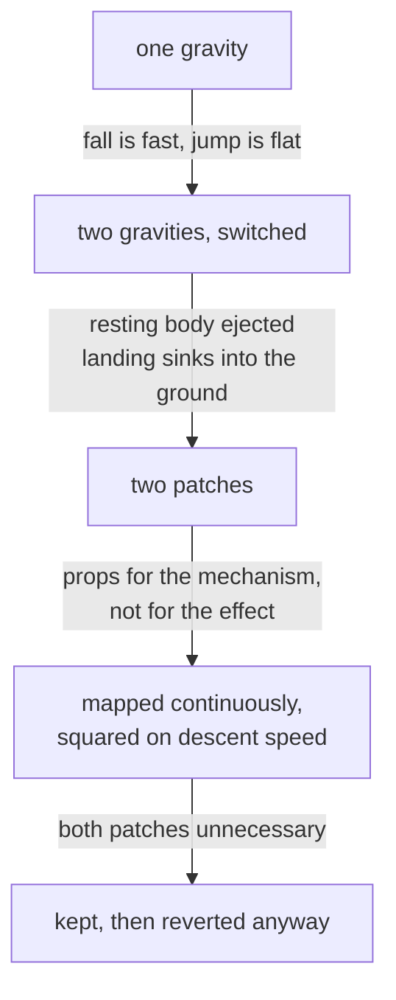

# What it actually takes to make a rolling ball feel heavy

Rock Runner's ball spent a long stretch of development feeling like a balloon,
and almost every intuitive fix for that turned out to be the wrong lever. This
is what each one really does, measured against the physics solver rather than
argued from first principles, and what finally worked.

## The lever that does nothing: mass

The obvious move is to make a heavy thing heavier. It does not work, and it is
worth being exact about why, because the reasoning survives being told.

A body's rate of fall does not depend on its mass. Dropped from the same height
in the same world, a 44 kg ball and a 4,460 kg ball reach the ground at the same
moment with the same velocity, agreeing to three decimal places. This is Galileo,
the physics engine implements it correctly, and no value in the mass field will
ever change how fast anything falls.

What mass does change is how much a given push moves the body — and that is a
real effect, but a costly one. Impulses are momentum, so they are divided by mass
to produce a speed. Leave the drive force alone and raise the mass, and the
result is not a weightier rock but a slower one:

| Mass | Reaches the speed cap in | Top speed reached |
| ---- | ------------------------ | ----------------- |
| 45   | 1.2s                     | 22 (the cap)      |
| 100  | 3.6s                     | 17.7              |
| 150  | 9.9s                     | 11.8              |
| 300  | never                    | 5.9               |

Past a point the rock cannot reach its own speed ramp at all, so the part of the
design where a run gets faster the longer it lasts simply stops happening.

Mass is worth raising for what it does to collisions between players, and it is
worth exposing so it can be felt. It is not the weight lever.

## The lever that works, and what it costs

Weight is gravity. In a rigid-body engine there is one world gravity, and a body
scales it: doubling a body's gravity scale makes it fall twice as hard while
leaving its resistance to being pushed alone.

The cost is that **one gravity governs both halves of an arc**. A jump's height
and its descent are the same number seen twice, so buying a faster fall spends
jump height at exactly the same rate:

| Gravity | Apex | Rise  | Fall  |
| ------- | ---- | ----- | ----- |
| 1       | 16.3 | 1.67s | 2.02s |
| 2       | 4.63 | 0.67s | 0.70s |
| 3       | 3.23 | 0.47s | 0.47s |

The jump does not survive that on its own. It has to be paid back.

## The attempt that looked right and was not

If one gravity governs both halves, the apparent fix is two: a light one on the
way up and a heavy one on the way down. This is a standard platformer technique
and it produces exactly the intended arc — full height, snapped descent.

In a rigid-body simulation it also produces two failures that a platformer's
hand-written character controller never meets.

The first is that a resting body is not at rest. A ball sitting on the ground
reads as very slightly descending, so a naive "am I falling" test is true while
it is standing still. Pressing a resting body into the ground at tens of times
gravity gives the solver a penetration it cannot resolve gently, and it responds
by ejecting the ball — measured along the real track, sixty units into the air,
on every run.

The second is the discontinuity itself. Stepping the scale from one value to
another mid-arc is a kink in the motion, and the landing arrives so hard that it
sinks nearly two units into the ground before being pushed back out.

Both were patchable — a tighter contact test for the first, a terminal speed for
the second — and the fact that both needed patching was the signal. **Props for a
mechanism, rather than for the effect it produces, mean the mechanism is wrong.**

Mapping the scale continuously off descent speed, squared, removed both patches
rather than tidying them. At the apex the descent speed is zero, so the mapped
value equals the rising gravity and the arc has no kink. A resting body is barely
descending, so it sits under essentially its own weight and the ejection has
nothing left to trigger. And a squared curve stays gentle over the first part of
a drop and bites only once genuinely falling, which keeps the landing shallow
without a clamp.

## The answer that was kept

The asymmetric version was removed all the same, and the arc went back to one
gravity — raised, with the jump raised alongside it to pay the height back.
Gravity 20 against a jump impulse of 6000 clears 8.5 units in 0.3 seconds up and
0.28 down, where the world's own gravity gave 16.3 units and a two-second
descent.

That is a worse arc on paper than the asymmetric one, which held full height
_and_ snapped the descent. It is better in the game, because the symmetric
version is one number doing one thing, and the asymmetric version was a mechanism
that had to be explained. The lesson is not that the clever approach was wrong —
it worked, and the measurements say so. It is that a tuning problem solved by
tuning beats a tuning problem solved by machinery.

## The bug hiding underneath all of it

None of the above was visible for most of the work, because the configured
gravity was never reaching the game.

The rock is held still through the countdown by setting its gravity scale to
zero, and released by setting it back. Released to **one** — the world's own
scale, not the rock's. That reads as undoing what the countdown did, and it is
not: it discarded whatever the rock had been configured with, for the entire
race, every race.

So the ball genuinely was a balloon, and no amount of tuning the constant would
have fixed it, because the constant was being thrown away a second after the run
began. Worth stating plainly: **when a value seems to have no effect, confirm it
is reaching the thing it names before tuning it further.**

## What generalises

- Mass does not affect fall rate. It never has, and the engine is not confused
  about this — check the assumption before building on it.
- One gravity governs both halves of an arc. Any change to the fall is a change
  to the jump unless the launch is changed with it.
- A rigid-body solver is not a character controller. Techniques that assume
  hand-written motion — switched gravity above all — meet failures in a solver
  that they never meet in a platformer.
- Count the props. A mechanism needing two patches to stand up is usually the
  wrong mechanism, and the patches are the evidence.
- Measure the arc, do not derive it. Damping bleeds off a climb, so apex does not
  scale with the square of the impulse, and every figure in this document came
  from running the solver rather than from the formula.
