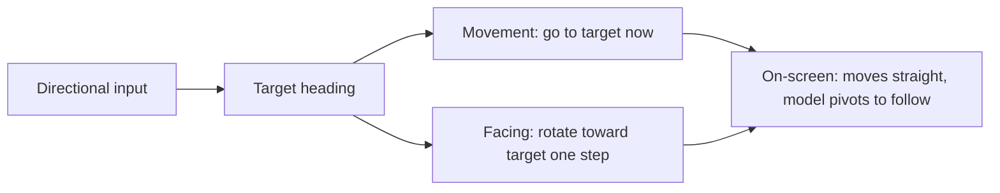

# Smooth Model Rotation: Interpolation, Heading, and Orientation

How the player-turning animation was built (issue #66, PR #195): interpolating a
model's rotation instead of snapping it, keeping movement responsive while the
model visually catches up, and correcting models whose geometry is oriented the
"wrong" way. The theory below is what made the difference between a fix that
worked and several that looked right on paper but failed on screen.

## Snapping versus interpolating

The original controller set the model's `rotation.y` directly to the input
heading every frame. Direction changes were instantaneous — there was no sense of
the character _turning_ to face a new way. The goal was to move the rotation
toward the target a little each frame so the turn is visible.

The naive approach — lerp the current angle toward the target — breaks at the
0°/360° seam. Interpolating from 350° to 10° the naive way sweeps backward
through 340°, spinning the model almost all the way around instead of nudging it
20° forward.

## Shortest-path angular interpolation

The core theory is computing the **shortest signed angular distance** between two
angles, which must respect wrap-around. The robust, branch-free way to get a
difference folded into the range `[-π, π]` is:

```
difference = atan2(sin(target − current), cos(target − current))
```

`sin`/`cos` map the raw difference onto the unit circle, discarding full
turns; `atan2` reads the angle back out, always choosing the representative in
`[-π, π]` — i.e. the shortest way round. From 350° to 10° this yields `+20°`, not
`-340°`. Each frame we then apply at most a fixed step of that difference, so the
model rotates toward the target the short way and stops cleanly once aligned.

## Choosing how the turn is paced

Three common ways to pace an interpolated rotation, and why the project uses the
first:

| Approach               | Behaviour                                        | Trade-off                                                       |
| ---------------------- | ------------------------------------------------ | --------------------------------------------------------------- |
| Max degrees per step   | Cap the applied change to _N_ degrees each frame | Constant, predictable turn speed; simple; the chosen default    |
| Angular velocity (°/s) | Multiply a turn rate by frame delta              | Frame-rate independent, but doesn't map to the issue's "step"   |
| Fixed lerp factor      | Move a fixed fraction of the remaining angle     | Smooth ease-out, but never a constant speed and never "arrives" |

The default step is 25° per frame — a full 180° turn resolves in roughly seven
frames: snappy but visibly a turn rather than a snap.

## Decoupling movement from facing

An early version moved the character along whichever way the mesh currently faced.
Because the mesh now turns gradually, the character _curved_ into the new heading
instead of going where the player pressed — it felt unresponsive on sharp turns.

The fix separates two concerns that had been conflated:

- **Movement** goes straight to the **target** heading immediately (responsive).
- **Facing** is purely visual and lags behind, catching up over a few frames.



Both derive from the same target heading, so they never disagree about
_direction_ — only about _how fast the visual catches up_.

## A three.js finding: `getWorldDirection` returns +Z

While deriving the movement vector from a heading angle, the first implementation
pointed the character the wrong way. The cause was an assumption about which axis
is "forward".

`Object3D.getWorldDirection()` returns the world-space direction of the object's
local **+Z** axis (it reads the third column of the world matrix, `e[8], e[9],
e[10]`). Cameras look down **−Z**, so it is easy to assume models face −Z too —
but the helper reports +Z. For a rotation `θ` about Y the direction is therefore
`(sin θ, 0, cos θ)`, **not** `(−sin θ, 0, −cos θ)`.

A unit test that compared the hand-derived direction against `getWorldDirection`
caught the sign error immediately — a good argument for pinning down engine
conventions with a test rather than reasoning about them in the abstract.

## Unifying the games behind one convention

Several games each compensated for their camera and model differently (mirrored
input maps, "move backward" flags). They all in fact use cameras on the **+Z
side** looking toward −Z. Because the shared heading convention treats "up" as 0°
= +Z, "away from the camera" is −Z — so an "up" press must map to the `move-down`
action. Adopting that single mapping plus one shared facing helper made every
game behave identically, leaving only genuine per-model quirks to configure.

## Model orientation: rotation versus reflection

Two independent things can be wrong with a loaded model's facing, and — this is
the key finding — they are **mathematically different transforms**:

| Problem                                    | Correction             | Nature                    |
| ------------------------------------------ | ---------------------- | ------------------------- |
| Model faces backward (front/back inverted) | `facingOffset: 180`    | Rotation (additive angle) |
| Model turns the mirror-image way           | `mirroredFacing: true` | Reflection (sign flip)    |

A **rotation offset cannot produce a mirror**. Adding a constant to every angle
can never turn left/right handedness around — a reflection is `θ → −θ`, an
additive offset is `θ → θ + c`, and no choice of `c` makes one equal the other.
This is why repeatedly tweaking an offset never fixed a model that _turned the
mirror way_: the tool was the wrong kind of transform.

The reflection is implemented by deriving the facing heading from the mirrored
directional map (which swaps left/right, i.e. `θ → 360° − θ`) while movement keeps
using the non-mirrored heading. Movement direction stays correct; only the visual
turn is reflected.

Both corrections are declared once in the model's load options and stored on the
model, so orientation quirks live with the model definition rather than being
re-derived in each game's movement code.

## Knobs, in summary

| Symptom                                    | Fix                                                         |
| ------------------------------------------ | ----------------------------------------------------------- |
| Turn is instant, no sense of pivoting      | Interpolate with a per-step cap                             |
| Character curves instead of going straight | Drive movement from the target heading, not the mesh facing |
| Pressing "up" moves toward the camera      | Map up-input to `move-down` for +Z cameras                  |
| Model faces its own back                   | `facingOffset: 180`                                         |
| Model turns the mirror-image way           | `mirroredFacing: true`                                      |
