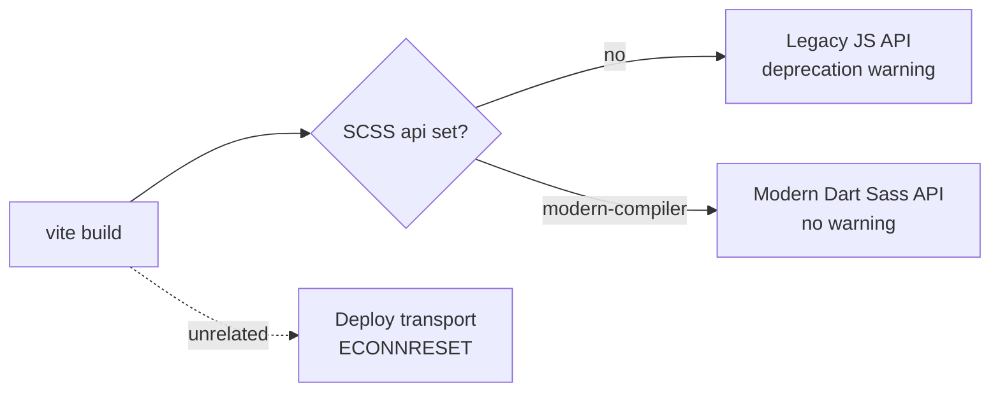

# Moving Off the Deprecated Sass Legacy JS API

## The symptom

A deploy build printed the Sass **legacy JS API** deprecation warning
(`https://sass-lang.com/d/legacy-js-api`) and a run then fell over with an
unhandled `ECONNRESET`. The two looked related because they appeared together,
but they are different layers: the warning is about how SCSS is compiled, the
socket error comes from the deploy environment.

## What was actually happening

The project compiles its `.scss` with pure Dart Sass (`sass`), and Vite was
calling it through the **legacy** JavaScript API by default — Dart Sass has
deprecated that API and will remove it in version 2. Nothing in the repo's own
build scripts opens a socket (the route pre-render step is plain file I/O), so
the `ECONNRESET` is raised by the deploy transport, not the build. Staying on the
deprecated compiler path is still the thing to fix: it is the warning the deploy
surfaced, and the modern API is the supported, more robust route.

## The fix

Vite is told to use the modern compiler API for SCSS, and `sass` is pinned as an
explicit dev dependency rather than relied on transitively. The build then
compiles cleanly with no deprecation warning.

## Guarding against regression

Importing the whole Vite config inside the test runner is unreliable — under the
jsdom environment it trips an esbuild `TextEncoder` invariant, and the config
also pulls in plugins that have no business loading during a unit test. So the
regression test reads the config **as source** and asserts the modern Sass API is
configured. It is a deliberately shallow check, but it is exactly enough to stop
the legacy API silently creeping back in a future edit.
