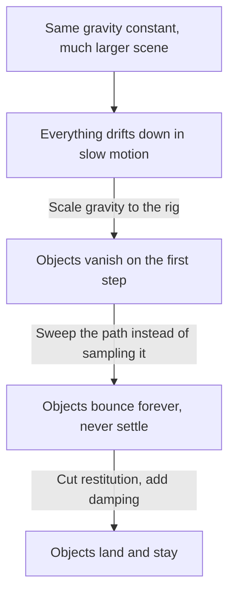

# Scale, gravity and tunnelling

Why a physics scene built around a model authored in centimetres needs both its gravity and
its collision detection adjusted, and what goes wrong at each step if only one of them is.

## The scene has no natural unit

A Rapier world is created with a gravity of 9.81 in whatever unit the scene happens to use.
Nothing declares that unit. A glTF character is usually authored in metres and stands around
two units tall; a Mixamo FBX of the same character is authored in centimetres and stands
around two hundred. The physics world cannot tell the difference, so it applies the same 9.81
to both, and only one of them looks like Earth.

The rig animator loads either. Dropping marbles onto a two-hundred-unit character at 9.81
units per second squared reads as a slow-motion moon landing: the marble is not falling
wrongly, it is falling correctly for a scene that is a hundred times larger than the one the
constant was chosen for.

The fix is to scale a falling body's gravity by how far its scene is from the scale the
constant suits, which Rapier exposes per body as a gravity scale rather than making the whole
world's gravity be rewritten. Measuring "how far" against the rig's own spread means it holds
for any model without anyone declaring a unit.

## Which then breaks collision

Scaling gravity up scales speed up with it, and speed is what collision detection is sensitive
to. Rapier's default discrete detection tests where a body _is_ at the end of a step, not
where it has _been_ during it. A body that crosses more distance in one step than the thing it
should hit is thick simply appears on the far side of it, having never been inside it at any
tested instant.

| Per step                     | Outcome                  |
| ---------------------------- | ------------------------ |
| Travel shorter than the wall | Detected, resolved       |
| Travel longer than the wall  | Passes through, silently |

This is the same phenomenon regardless of scale; raising gravity just walks a scene into it.
The symptom is unhelpful, because nothing errors and nothing logs: the objects are created,
the world steps, and they are simply gone. Continuous collision detection, enabled per body,
sweeps the whole path instead of sampling its end, and costs enough that it belongs on the few
fast bodies rather than on everything.

## And a third failure that looks the same

Between "falls too slowly" and "falls through the floor" sits a third outcome that is easy to
mistake for either: a body that never settles. Restitution is a fraction of impact speed, so a
lively bounce that is pleasant at human scale returns hundreds of units per second at a scale
a hundred times larger. A flow of marbles each bouncing that hard reads, at any single moment,
as a cloud of objects hanging in mid-air, which looks far more like "gravity is not being
applied" than like "gravity is being applied very well".

Three symptoms, one cause, and they arrive in sequence as each is fixed:

The order matters when debugging: each fix reveals the next symptom, so an intermediate state
that looks worse than where it started is usually progress rather than a wrong turn.

## The one that is not a physics problem at all

Worth naming because it wastes the most time. A body and the mesh drawn for it are two
separate transforms, and stepping the world moves only the first. A scene where the simulation
is entirely correct and nothing on screen ever moves is not a physics bug; it is a missing
per-frame copy from body to mesh. It presents identically to "the objects were never created",
because the meshes sit exactly where they were spawned, which for anything dropped from above
is off the top of the frame.
