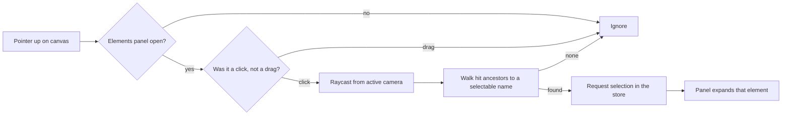

# Selecting Scene Elements by Clicking in the Viewport

## The gap

The Elements panel lists every named object in a scene and lets you expand one to edit its properties. But finding the row for a specific object meant scanning the list by name — there was no way to go the other direction, from "that thing I can see in the 3D view" to "its entry in the panel". For scenes with many similarly named elements (several goombas, a cluster of cubes) this is the slow path.

## The interaction

When the Elements panel is open, clicking an object in the viewport now selects and expands its row in the panel. Clicking empty ground selects the ground; clicking a goomba selects that goomba. The panel scrolls the row into focus and opens its properties, exactly as if the row had been clicked directly.

Selection only happens while the panel is open — when it is closed, viewport clicks fall through to the camera and any other scene interaction untouched.

## Click versus drag

The viewport already responds to dragging — orbiting the camera, and drawing path nodes on elements that have a path enabled. A naive "select on mouseup" would fire selection at the end of every orbit drag. The picker therefore records the pointer-down position and only treats the gesture as a selection when the pointer-up lands within a few pixels of it. Anything larger is a drag and is left to the camera and path tools.

## Resolving a click to an element

A ray cast into the scene hits whatever triangle is frontmost, which is often a deep child mesh — a sub-mesh of an imported model, not the named group the panel knows about. The picker walks up the parent chain from the hit object and, for each ancestor, asks a scene-supplied `matchObject` callback whether it maps to a selectable id. The first non-null answer wins. Hits sorted by distance mean a goomba standing in front of the ground resolves to the goomba, while a click into open space resolves to the ground behind it.

## Mapping clicks to groups, not just elements

Not everything visible has its own panel row. Instanced bricks share a single "Bricks" group entry; the spawned balls share a "Balls" group; clouds belong to a "Clouds" texture-area group. The individual `brick-3`/`ball-7`/`cloud-2` meshes are deliberately kept out of the panel list (they would bury the useful rows). So `matchObject` translates them: a name starting with `brick-` resolves to the Bricks group id, `ball` to the Balls group, and any mesh tagged with a texture-group id in its `userData` resolves to that group. Clicking any brick, ball, or cloud therefore selects and expands the group it belongs to, while clicking a standalone element (a goomba, the ground) selects that element directly. The mapping lives in the scene, so each scene decides how its own meshes roll up into panel rows.

## Keeping path visuals out of the panel

Drawing a path adds a tube and node meshes to the scene. Because those objects exist in the scene graph at the moment the panel's element list is captured, they would otherwise show up as anonymous "Group" rows. They are tagged with a `userData` flag when created and filtered out of the panel's element list alongside the grouped brick and ball meshes, so the panel only ever lists meaningful, selectable entries. `matchObject` likewise ignores them, so clicking a path tube selects whatever lies behind it rather than the path itself.

## Decoupling the picker from the panel

The picker lives in the scene (it needs the camera, canvas, and scene graph); the expansion logic lives in the panel. They communicate through the element-properties store rather than direct references. The store exposes a selection request that sets the selected name and bumps a nonce counter. The panel watches the nonce and expands whatever element is currently selected. Routing through a nonce — rather than only watching the selected name — means re-clicking the already-selected element still re-triggers the panel, instead of being swallowed because the name did not change.

## Following the active camera

The raycast must originate from whatever camera is actually rendering. This scene can swap between a perspective and an orthographic camera at runtime via the camera presets, so the picker cannot capture the initial camera once. The scene wraps the camera-swap callback to keep a reference to the current camera, and the picker reads that reference on every click — so selection keeps working after switching projection. The same wrapped reference is reused for path drawing, which previously also raycast against a stale camera.

## Reusability

The picker is a standalone composable parameterised entirely by callbacks — how to read the camera, which objects to test, which names are selectable, when it is allowed to run, and what to do with a pick. It carries no knowledge of this particular scene, so any view that registers scene elements can opt in with a few lines.
