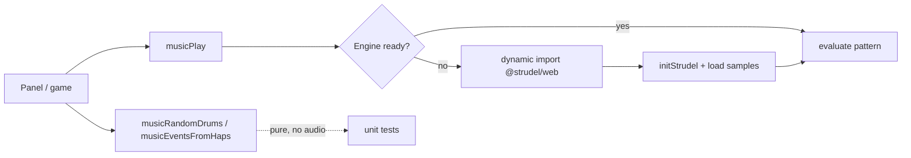

# Generative Music with Strudel

## The goal

Add in-browser, generative music the whole app can use — a live "Music" panel to
experiment with, and a richer track source for the rhythm game — built on
[Strudel](https://strudel.cc), the JavaScript port of TidalCycles. The Strudel
wrapper lives in its own framework-agnostic package, `@webgamekit/music`, so the
panel, the games, and any visual-sync code share one engine.

## Keeping the engine out of the tests

Strudel is a browser library: importing it touches the Web Audio API and other
globals that do not exist under the unit-test runner. The package therefore never
imports `@strudel/web` at module load — it is pulled in by a dynamic import inside
`musicInit`, which runs only in the browser. Everything else in the package — the
pattern library, the random-pattern generator, and the hap-to-note-event mapper —
is pure and importable anywhere, so it can be unit-tested without an audio context.

## Two sample gotchas

Getting actual drum sounds to play surfaced two non-obvious issues, both worth
remembering:

1. **`initStrudel` does not load a drum bank on its own.** Calling it and then
   evaluating `s("bd hh sd")` raises "sound not found". Samples must be loaded
   explicitly, and the supported place to do it is Strudel's `prebake` init hook,
   which runs during initialisation before any pattern is evaluated.
2. **The `github:` sample shorthand assumes the wrong branch, and sound names are
   not what you'd guess.** The dirt-samples repository's default branch is
   `master`, while the shorthand resolves to `main`, so the convenient
   `github:tidalcycles/dirt-samples` form failed to load; the explicit raw URL is
   used instead. And the open hi-hat is `ho`, not `oh` — the first generated
   pattern that reached for `oh` was the symptom that started this whole thread.

The random-pattern generator only emits tokens that exist in the loaded bank, so a
freshly generated beat can never ask for a sound that is not there.

## Lifecycle around Vue

The package is deliberately framework-free, so a thin composable adapts it to Vue:
it tracks play state and surfaces errors, and — importantly — stops playback when
the component unmounts, so closing the Music panel or leaving a game never leaves
a pattern looping in the background.

## Wiring the panel in

The Music panel is a normal right-side panel: it registers a new `music` panel
type, takes a slot in the right-panel stack order, and gets a button in the global
navigation, exactly like the debug and timeline panels. Its controls are buttons
and a slider (presets, a randomiser, play/stop, tempo) with the active pattern
shown read-only, so the panel needs no free-text input.
