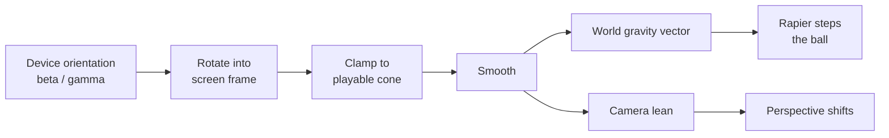

# Tilt Maze: Steering A Board With The Phone Itself

A ball-in-a-labyrinth game whose only input is the angle the player holds their phone at.
Almost everything that went wrong here was invisible from the code: a browser gate that fails
silently, a sensor that measures posture rather than intent, a camera aiming degeneracy, and a
physics engine optimisation. Very little of it was our own logic being wrong.

## Tilting gravity, not the board

The obvious reading of "the player tilts the board" is that the board tilts. That means
re-orienting every wall collider on every frame, and a maze has dozens of them. The cheaper
model inverts the relationship: the board and its colliders never move, and the world's
gravity vector rotates instead. To a player watching a ball roll, the two are
indistinguishable, because the only evidence of a tilt they ever get is which way the ball
goes.

The perspective that sells the illusion is then a separate, purely visual concern. The
camera leans by a fraction of the same angle, which costs one position assignment and no
physics at all. Splitting the problem this way means the expensive half — the simulation —
does the least work, while the half that only has to look right does the rest.

## The sensor is gated twice, and one gate is silent

Device orientation is commonly described as "iOS needs a permission prompt". That is the
loud gate, and it is easy to handle: a static permission request exists only on iOS, must be
called from a real user gesture, and resolves to a grant or a refusal.

The quiet gate is the one that costs an afternoon. Orientation events require a **secure
context on every platform**, not just iOS. A development server reachable over the local
network by plain HTTP delivers no events at all — no error, no rejected promise, no console
warning. The sensor simply appears to be absent, which is indistinguishable from a device
that has none. Anyone testing a tilt feature on a real phone against a default dev server
will conclude their code is broken.

The consequence is that HTTPS is not a deployment concern here, it is a development
prerequisite, and the UI must be able to say so. Reporting the secure-context flag back to
the player turns a mystifying dead sensor into a sentence explaining what to run instead.

| Gate                 | Platform                               | Failure mode                             |
| -------------------- | -------------------------------------- | ---------------------------------------- |
| Secure context       | all                                    | Silent — no events, no error             |
| Permission grant     | iOS only                               | Explicit — promise resolves to a refusal |
| Transient activation | all, for both the grant and fullscreen | Explicit — the call is rejected          |

Because the permission request and entering fullscreen both need a gesture, and a browser
will only offer the orientation prompt once, both belong on the same single tap. Spending
two gestures on them is not just clumsy, it risks spending the prompt.

## Nobody plays with their phone on a table

The first build on real hardware appeared dead, then appeared to steer backwards. Neither was
true. The sensor reports an absolute pose relative to the ground, and a phone held up to be
looked at already reads somewhere between forty-five and seventy degrees of front-to-back
tilt before the player has moved at all. Feeding that raw into a lean limit of a couple of
dozen degrees pins the board at full slope permanently: the ball sits against one edge, and
tilting further changes nothing because the value was already clamped. Tilting the other way
only does anything once the reading crosses back inside the limit, which happens abruptly and
in the wrong place — which is exactly what "inverted" feels like from the player's side.

The correct mental model is that the sensor measures posture, and a game wants _change in_
posture. Whatever pose the player happens to be in when play begins is the only sensible
definition of level, so it has to be captured and subtracted. That single subtraction is the
difference between an unplayable game and a playable one, and no amount of retuning the limit
substitutes for it, because the problem is an offset rather than a scale.

Two consequences follow. A rotation of the screen invalidates the neutral, because the axis
the player reads as left-to-right is no longer the axis the neutral was captured against, so
the reference has to be retaken. And the player needs a way to retake it themselves, since
posture drifts over a session — a lean that felt level at the start slowly becomes a
permanent pull.

Because this is posture handling rather than game logic, it belongs with the other input
devices rather than in one game. Tilt now lives in the controls package alongside keyboard,
gamepad and touch: leans past a threshold surface as ordinary pressed and released actions, so
a game gains tilt support by adding a mapping and nothing else, while games that steer by angle
read the continuous lean directly. The calibration, the screen-frame rotation and the
permission gate are then solved once instead of per game.

## The specification is right and the hardware may still disagree

The convention is unambiguous: a positive left-to-right reading means the right edge is
tipped toward the ground, and a device standing upright with its top pointing away reads
ninety degrees front-to-back. Deriving the mapping from that gives a board that rolls the way
it looks.

It is still worth exposing a switch that flips both axes. Not because the specification is in
doubt, but because a player reporting "it goes the wrong way" has no way to distinguish a
firmware quirk from a saturated input from a genuine sign error, and a switch settles the
question in one tap instead of one round trip. The default should follow the specification;
the switch exists for the device that does not.

## One tap buys one activation, and two APIs both want it

The permission request needs the transient activation of a real tap. So does entering
fullscreen — the Fullscreen standard consumes it explicitly. A start handler that did both,
which is the obvious design when a single button means "begin playing", therefore starved
whichever call ran second.

This produced the worst possible failure signature. Ordering the grant first left fullscreen
silently rejected, which looked like a fullscreen bug. Reordering to fix _that_ left the
permission sheet never appearing, which looked exactly like a device with no sensor — and the
apparent regression pointed at the sensor code, which was correct throughout. Two plausible
orderings, each breaking the other feature, with no error surfaced by either.

The resolution is not a cleverer ordering but a smaller ask: one gesture should drive one
activation-consuming call, and the essential one takes it. Fullscreen is a nicety and can have
its own button. Any pair of APIs sharing this requirement — pointer lock, screen orientation
lock, clipboard writes — deserves the same treatment rather than being bundled into one tap.

## The setting everyone tells you to check no longer exists

Search results, forum answers and this project's own first draft all send an iPhone user to
Settings → Safari → Motion & Orientation Access. That switch was removed in iOS 13, roughly
seven years before this was written, when Apple replaced the global opt-in with the per-site
prompt. Advice written for iOS 12 simply outlived the thing it described, and it is repeated
often enough to read as current.

The consequence for a diagnostic dialog is sharper than it looks: guidance that names a
non-existent control does not merely fail to help, it convinces the player the problem is on
their side and hides the real cause. What actually holds a refusal on a modern iPhone is the
site's stored data, and clearing it under Settings → Apps → Safari → Advanced → Website Data is
what brings the prompt back.

## Fullscreen exists, but only recently, and never on your terms

Fullscreen on an arbitrary element was unavailable on iPhone Safari for years; only video
elements could go fullscreen. Support for ordinary elements arrived during iOS 17. Desktop
Safari unprefixed its implementation in 16.4. The practical shape of this is that the
prefixed entry points still earn their place as a fallback, and a browser that refuses
outright has to degrade to windowed play rather than throw.

The more important property is that fullscreen is never fully yours. The player can always
leave through a system gesture or a key you never see. State must therefore be read back
from the change event rather than inferred from the call that requested it, or the UI will
confidently offer to exit a fullscreen the player already left.

Screen orientation locking is a related trap: it requires fullscreen first and is entirely
absent from Safari. A rotate-your-phone prompt driven by a media query is the portable
answer, and the lock is not worth reaching for.

## Fitting a board to a screen instead of a screen to a board

A fixed square board is the wrong shape for every phone. Held upright, a square board either
fills the width and leaves half the screen empty, or fills the height and runs off the sides.
Scaling it to fit shrinks the corridors and the ball with it, so the game gets harder on
exactly the devices with the smallest screens.

Holding the cell size constant and letting the screen decide the cell _count_ inverts this. A
corridor is then the same width everywhere, difficulty does not track screen size, and a
portrait phone gets a long thin maze that fills it. The maze generators already accepted
independent row and column counts; only the conversion from grid to world coordinates assumed
a square, which is a narrower assumption than it first appears and cheap to lift.

Framing then has to fit both axes independently. A perspective camera constrains the vertical
extent directly and the horizontal only through the aspect ratio, so each axis implies its own
camera distance and the board fits only at the larger of the two. A later rotation refits the
framing rather than regenerating the board, since regenerating would discard the run in
progress.

One consequence is not obvious until a long board exists: placing hazards by taking the
candidates furthest from the spawn piles all of them at the far end. On a square board that
merely looks slightly odd; on a long portrait board the entire first half of the run is
empty. Drawing one hazard per distance band instead spreads them across the whole route.

## A camera looking straight down has no idea which way is up

The first working build spun the entire board through forty-five degrees whenever the player
leaned diagonally. Nothing in the scene had rotated; the camera had.

Pointing a camera at a target computes its roll from a reference up-vector, by taking the
component of that vector perpendicular to the view direction. When the camera looks almost
straight down and the reference up-vector is world-up, those two directions are nearly
parallel, and the perpendicular component is nearly nothing. The roll is then decided by
whatever tiny numerical residue survives, and it swings wildly as the camera drifts off the
vertical axis. This is a degeneracy in the aiming maths, not a bug in the scene.

Any top-down camera that moves has this problem latent in it. The fix is to pin the
reference up-vector to a direction actually perpendicular to the view — for a board viewed
from above, the direction the far edge lies in. That choice also fixes which way is "up" on
screen, so it has to agree with the frame the tilt maths already assumed. Getting them to
agree is not optional polish; disagreement means the ball rolls at an angle to the lean.

## Changing gravity does not wake a sleeping body

Physics engines put bodies that have come to rest to sleep, so that a settled scene costs
nothing. Waking them is driven by events the engine can observe: a collision, an applied
impulse, an explicit call.

Reassigning the world's gravity is not such an event. A ball resting against a wall is
asleep, and it stays asleep when the board tilts the other way, because from the engine's
point of view nothing happened to it. The symptom is a game that works until the player
first comes to a stop, and then never responds again — which reads as an input bug and sends
you looking in entirely the wrong place.

Any design that steers bodies by mutating world gravity rather than applying forces has to
keep the steered bodies awake explicitly. This is the cost of the cheap tilt model, and it
is worth paying, but it is invisible until it bites.

## A level is a new board, and a mesh is only half of one

Levels get harder by cutting the same board into more, smaller cells rather than by growing
it: a screen-sized board is already as large as it can be, so the only room left is finer
corridors. That makes every level a fresh board rather than an edited one, and the teardown is
where this gets interesting.

An object in this stack exists twice — once as a mesh the renderer draws, once as a rigid body
the physics engine simulates. Removing it from the scene deletes only the half you can see.
The old walls keep their colliders, and the next level's ball collides with a maze that is no
longer drawn: a ball stopping in open corridors for no visible reason, which reads as a physics
bug rather than a cleanup one. Disposal has to remove both halves, and the cheapest proof that
it does is counting bodies after several rebuilds — the total should return to the same figure
each time rather than climbing.

Deriving sizes from the cell rather than fixing them is the other half of the same idea. A ball
radius that never changes is eventually wider than the corridor it has to roll down, and a hole
radius that never changes eventually cannot swallow the ball at all, making the goal
unreachable. Both are silent: the level simply becomes unplayable at some level number nobody
tested.

## Reading a slow scene as a broken one

A headless browser renders through a software rasteriser, and a shadowed scene of a few
dozen objects can drop to a handful of frames a second. A physics step advances a fixed
slice of simulated time per frame, so a scripted "hold the key for three seconds" delivers
a fraction of a second of simulation. The ball moves a distance too small to see.

Twice this looked like a physics failure and prompted a fix for a bug that did not exist.
The lesson generalises past this game: when verifying physics through an automated browser,
assert on the body's own coordinates rather than on a screenshot, and treat wall-clock
duration as unrelated to simulated duration. The numbers settled the question immediately
once they were asked for — the ball had stopped at a position exactly one radius from a wall
face, which is not what a broken simulation looks like.
