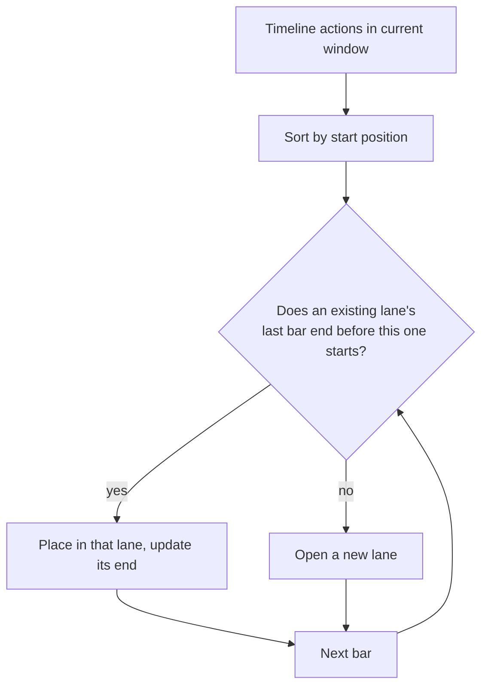
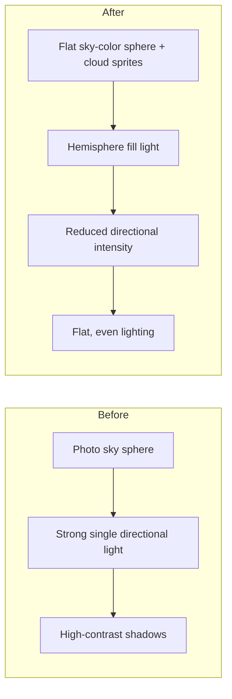
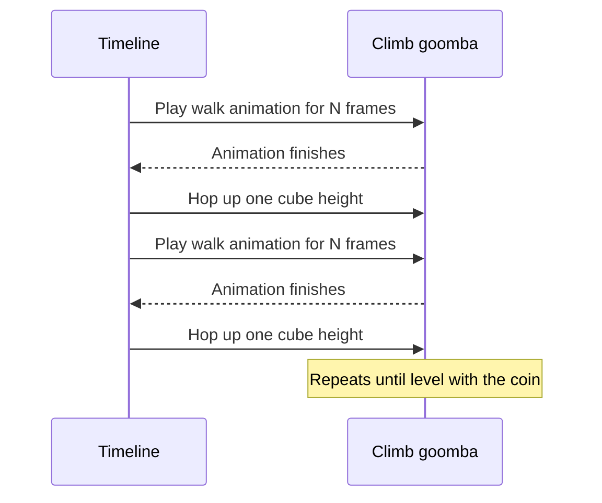
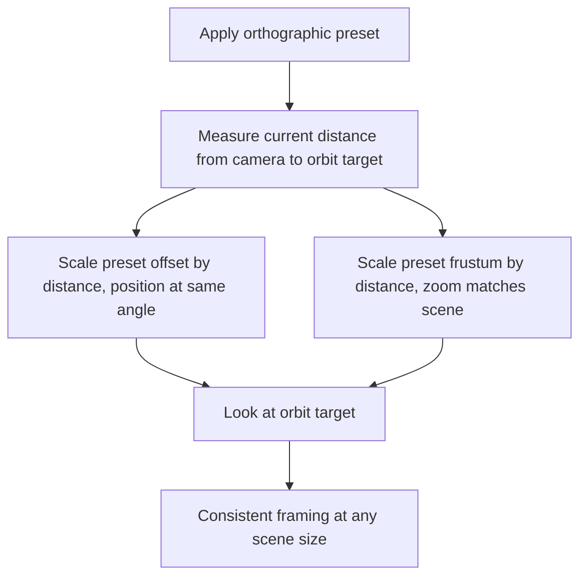

# Timeline Editor and Timeline Test Scene Fixes

## Overlapping timeline bars in the new Timeline panel

Issue #20 asked for a debug-style panel that shows every timeline action as a bar across a fixed time window, with a moving cursor and a click-to-inspect details view. The first version rendered every bar in a single row, absolutely positioned by start/end percentage.

In the Timeline test scene, several actions start at the same frame (multiple goombas kick off their first move at frame zero). With a single row, those bars stacked exactly on top of each other. Visually only the topmost bar was visible, and — more importantly — only the topmost bar could receive clicks, so the others were impossible to inspect.

The fix assigns each bar to a vertical "lane": bars are sorted by their start position, and each one is placed in the first lane whose previous occupant has already ended. Overlapping actions spread out into additional lanes instead of hiding each other, and the panel's track grows tall enough to fit however many lanes are needed for the current time window.

## Goomba walk animation never played

The Timeline test scene's goombas are driven by `controllerForward`, which looks up an animation clip by name and plays it while the model moves. The lookup name baked into the scene was `'run'`.

The `goomba.glb` model only ships a single animation clip, and its name — set by the original export — is `'Take 001'`, not `'run'`. Every frame, the animation lookup silently failed (no matching key), so the goombas sled across the ground without ever playing a walk cycle.

The fix was a one-line rename of the looked-up clip name to match the model's actual clip. With the correct name, the existing animation-binding code (mixer lookup, fade-in, loop mode) needed no other changes — it had been correct all along, just pointed at a name that didn't exist.

## Coin invisible due to a scale mismatch

The coin model is built from a small extruded/cylinder geometry sized in "real-world" units — a coin a few centimeters across. Every other object in the Timeline scene (ground, cubes, balls, goombas) is built on a much larger unit scale, where a single ground tile is tens of units wide.

Dropped into the scene at its native size, the coin was roughly a thousand times smaller than the cubes around it — effectively a single sub-pixel speck from the camera's distance, indistinguishable from nothing.

The fix scales the coin's mesh up after creation to match the surrounding scene's unit scale, and repositions it on top of a dedicated platform so it sits at a height where it's actually in view rather than buried inside or below the surrounding geometry.

## Cubes not resting on the ground plane

The ground plane in the Timeline scene is a thin box, and its top surface sits at a small negative offset from world origin (a leftover from the default ground configuration, which centers the ground slightly below zero). The static cubes were positioned assuming the ground's top surface was exactly at zero.

The discrepancy was small — a couple of units — but enough that every cube's bottom face sat slightly below the ground's top face, sinking the whole cube cluster a little into the terrain.

The fix shifts every cube's vertical position up by the same small offset, so the bottom faces line up exactly with the ground's actual top surface.

## Sky, clouds, and flatter lighting

The scene previously used a photographic landscape image projected onto the sky sphere, combined with a single, fairly strong directional light and no ambient fill. This produced harsh, high-contrast shadows and a sky that didn't read as "sky" — it read as a wallpapered photo.

The fix replaces the photo sky with a flat sky-color sphere, adds a hemisphere light (a soft top/bottom color gradient that mimics sky-bounce and ground-bounce light), and reduces the directional light's intensity. Together these flatten the contrast between lit and shadowed faces, giving the scene a brighter, more "toy diorama" look. A handful of flat cloud sprites — reused from the existing cloud-rendering helper used elsewhere in the project — were scattered above the scene to reinforce the sky read.

## Redesigning the goomba test timelines

The scene originally drove six goombas through a grab-bag of timeline actions — turns, forward walks, and jumps in various combinations — none of which were named or organized around a specific test purpose, and (per the animation-name bug above) none of which actually animated.

The fix consolidates this into three goombas, each demonstrating a distinct, named timeline pattern:

- **Patrol**: walks a continuous square loop, turning at each corner — a test of repeating, cyclic timeline actions and looped movement.
- **Wall-bang**: walks straight at the existing cube wall on a loop, repeatedly colliding with it — a test of obstacle-collision handling, since the controller is expected to block forward movement on contact.
- **Climb**: ascends a dedicated three-cube tower toward the relocated coin, alternating a walk animation of a deliberately configurable duration with a vertical hop onto the next cube — a test of using the timeline to sequence an animation for an exact, tunable length before triggering the next step.

## Heavier balls

The bouncing balls in the scene used the default mass/weight values from the model-options helper, which made them feel light and "floaty" against the much larger cubes. Increasing the weight option passed to every ball — including the one spawned periodically by its own timeline action — gives them noticeably more inertia and a heavier landing impact, better matching their visual size relative to the rest of the scene.

## Orthographic camera presets zoomed in far too close

Switching the camera to an orthographic preset made the scene jump to an extreme close-up, showing only a tiny patch of geometry. The root cause is a fundamental difference between the two projection types. A perspective camera's apparent zoom depends on how far it sits from what it looks at, so moving it back reveals more of the scene. An orthographic camera ignores distance entirely: its zoom is governed solely by the size of its viewing box (the frustum). The preset definitions carried a fixed frustum size that had been tuned for a small reference scene where objects span a handful of units. Dropped into this scene — where the camera sits hundreds of units back and the ground stretches across thousands — that same small box framed only a sliver of the world.

The fix makes the orthographic preset _scene-aware_. Instead of applying the preset's literal frustum size and position, it treats those values as a direction and a proportion. It reads the camera's current distance from the orbit target as a measure of the scene's scale, then scales both the preset's offset and its frustum size by that distance. The preset's intended viewing angle and its framing ratio (how much of the view the subject fills) are preserved, but the absolute zoom now matches whatever scene it is applied to.

## Orthographic views clipping the scene

Even with the zoom corrected, parts of the scene vanished — the near and far clipping planes were cutting through geometry. An orthographic camera placed far from the scene needs a depth range that brackets everything in front of and behind the focal point, but the preset's near/far values were small constants left over from the reference scene. Because the camera can end up positioned such that some objects fall behind its near plane, the range also needs to extend _behind_ the camera, not just in front of it.

The fix derives a generous depth span from the same distance-and-frustum measure used for zoom, pushing the near plane well behind the camera and the far plane well past the subject. Orthographic projection has linear depth, so widening this range does not cost the depth precision that the same change would cost on a perspective camera. The panel's near/far controls were also extended to drive orthographic cameras, which previously only responded on the perspective path.

## Preserving position on same-type preset changes

Camera presets come in two flavours: ones that change the projection type (perspective to orthographic, or back) and ones that only restyle the current camera. A regression briefly made _every_ preset reset the camera's position to the preset's reference coordinates, so re-styling a perspective camera — for example switching to a wider field of view — teleported it away from wherever the user had positioned it.

The corrected behaviour treats the two cases differently. A perspective-to-perspective change only touches lens properties (field of view and clip planes) and leaves position and rotation untouched. A change that alters the projection type, or any orthographic preset, runs the scene-aware repositioning described above, because those genuinely intend to reframe the view. This split is covered by a unit test that asserts a same-type field-of-view preset changes the lens without moving the camera.

## Booting the test scene straight into an orthographic view

The Timeline test scene is most readable from a fixed three-quarter orthographic angle, so it should open in that view rather than the default perspective one. Rather than hand-construct an orthographic camera and copy in captured coordinates — which would drift out of sync the moment the preset logic changed — the scene reuses the preset machinery itself. After the camera registers, the scene programmatically applies the orthographic preset and then repeats the same 45° rotation the panel button performs, twice, to reach the desired angle. The result is identical to a user clicking those controls by hand, and it automatically inherits any future improvement to the preset logic. This boot sequence lives in the scene's own setup, so no other view is affected.
