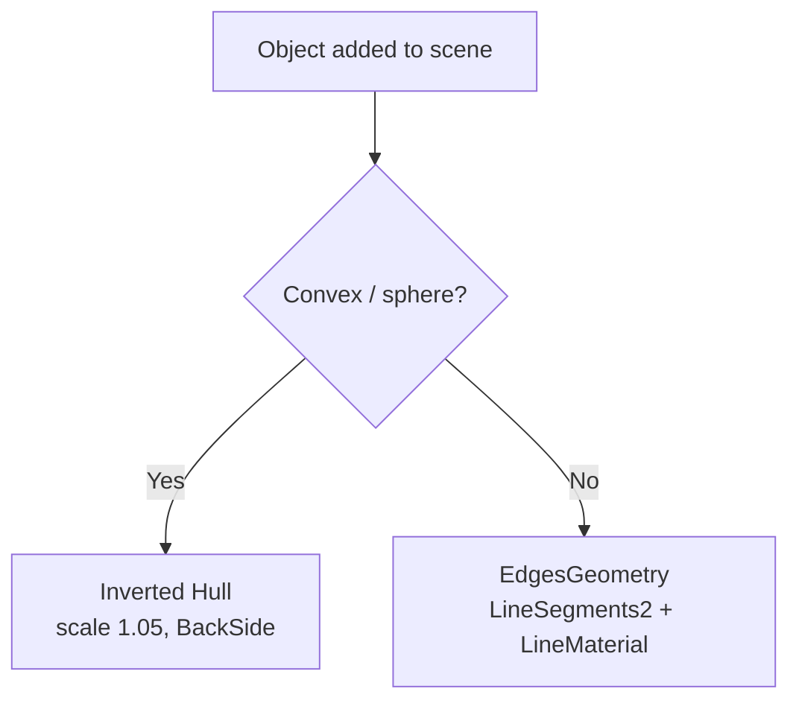

# Toon Stroke Outlines in Three.js

Adding black outlines to 3D objects to create a toon/sketch aesthetic. Two techniques are needed because they solve different problems.

## Why two techniques

No single approach works for every mesh:

- **Inverted hull** — perfect for convex shapes (spheres, capsules). Adds a stroke by rendering a slightly scaled-up copy of the mesh with back faces only and a flat dark material. Zero GPU cost, no shader needed.
- **EdgesGeometry + LineSegments2** — correct for flat-faced objects (boxes, platforms, obstacles). Traces silhouette and crease edges at a configurable angle threshold.

`LineBasicMaterial` ignores `linewidth` in WebGL (browser limitation). Use `LineMaterial` + `LineSegments2` from `three/examples/jsm/lines/` for any line thicker than 1px.



## Inverted hull

```typescript
const STROKE_MATERIAL = new THREE.MeshBasicMaterial({ color: 0x333333, side: THREE.BackSide })

const attachBallStroke = (mesh: THREE.Mesh): void => {
  const hull = new THREE.Mesh(mesh.geometry, STROKE_MATERIAL)
  hull.scale.setScalar(1.05)
  hull.userData.skipEdgeLines = true // prevent double-processing
  mesh.add(hull)
}
```

The hull shares the same geometry but renders only back faces. When the camera sees the inside of the hull through the outer mesh, the hull peeks out as a uniform outline ring. Scale 1.05 gives a stroke about 5% of the object radius — adjust to taste.

## EdgesGeometry + LineSegments2

```typescript
const attachEdgeLines = async (mesh: THREE.Mesh): Promise<void> => {
  const [{ LineMaterial }, { LineSegments2 }, { LineSegmentsGeometry }] = await Promise.all([
    import('three/examples/jsm/lines/LineMaterial.js'),
    import('three/examples/jsm/lines/LineSegments2.js'),
    import('three/examples/jsm/lines/LineSegmentsGeometry.js')
  ])
  const edges = new THREE.EdgesGeometry(mesh.geometry, 15) // 15° crease threshold
  const geometry = new LineSegmentsGeometry().fromEdgesGeometry(edges)
  const material = new LineMaterial({
    color: 0x333333,
    linewidth: 2,
    resolution: new THREE.Vector2(window.innerWidth, window.innerHeight)
  })
  mesh.add(new LineSegments2(geometry, material))
}
```

`LineMaterial` requires a `resolution` uniform matching the canvas size. The crease threshold (15°) controls how many interior edges are drawn — lower values show more edges.

## Scene traversal

Apply edge lines after all objects are built, then skip objects that already have strokes or should be excluded:

```typescript
const isSolidMesh = (object: THREE.Object3D): object is THREE.Mesh => {
  if (!(object instanceof THREE.Mesh)) return false
  if (object.userData.skipEdgeLines) return false
  const mat = Array.isArray(object.material) ? object.material[0] : object.material
  return !(mat instanceof THREE.Material && mat.transparent)
}

scene.traverse((object) => {
  if (isSolidMesh(object)) attachEdgeLines(object)
})
```

Mark objects to skip with `mesh.userData.skipEdgeLines = true` — useful for the hull child meshes themselves, underground/background objects too large to draw edges on, and transparent meshes (clouds, glass).

## What didn't work

**OutlinePass** (post-processing): renders the outline in screen space after the scene is drawn. Looks correct for isolated objects but haloes bleed across object boundaries and the result is soft, not sketch-like. No easy way to vary thickness per object. Dropped in favour of the mesh-level approach above.
