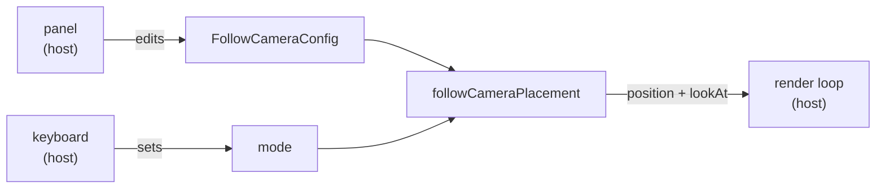

# Follow camera

`@webgamekit/threejs` ships the three cameras a game that follows a moving thing
almost always needs: a chase camera behind it, a first-person eye riding it, and
a free camera pulled back to see the whole scene. The package owns the
arithmetic and the settings; the host owns the rendering and the panel.

<video controls loop muted playsinline width="720" src="/video/rock-runner/camera-modes.webm">
  A rock rolls down a forest track while the camera cycles through the three modes: a chase
  camera behind it, a first-person eye riding it, and a free camera pulled back off the track,
  each change easing into place rather than snapping.
</video>


## What is in the package

Everything here is pure and framework-free — no Vue, no store, no DOM.

| Export                    | What it is                                             |
| ------------------------- | ------------------------------------------------------ |
| `FollowCameraMode`        | `'third' \| 'first' \| 'free'`                         |
| `FollowCameraConfig`      | Offsets for all three, plus the mode-change duration   |
| `DEFAULT_FOLLOW_CAMERA`   | A usable starting set                                  |
| `FOLLOW_CAMERA_MODES`     | The three modes in display order                       |
| `followCameraPlacement`   | Where the camera should sit and look, for one mode     |
| `followCameraEase`        | Eases a mode change so it settles rather than snapping |
| `followCameraSchema`      | Panel controls for one mode, as plain data             |
| `followCameraAllControls` | Every control across every mode                        |

### Placing the camera

`followCameraPlacement` returns a position and a look target rather than moving
anything, so the caller decides whether to snap to it, ease into it, or hand it
to orbit controls:

```ts
const { position, lookAt } = followCameraPlacement(mode, target, heading, config)
camera.position.lerpVectors(transitionStart, position, followCameraEase(alpha))
camera.lookAt(lookAt)
```

`heading` is a unit vector on the horizontal plane — usually the followed body's
smoothed travel direction rather than its raw velocity, so a brief reversal does
not flip the whole frame.

Two details are worth knowing because they are decisions rather than
implementation:

- **The first-person look target sits at the eye's own height**, so that view is
  level rather than angled down. Eye height alone decides how much of the way
  ahead is visible; there is no pitch to tune.
- **The eye rides ahead of the body, not on top of it.** Pushed forward past the
  body's own radius, the whole thing falls behind the camera and is never drawn,
  which is what stops a player seeing their own model from inside it.

## Putting it on the elements panel

The package deliberately stops at describing its controls. Rendering them is the
host's business, and `src/utils/followCameraPanel.ts` does it for this app in one
call:

```ts
const panel = registerFollowCameraPanel({
  targetLabel: 'the runner', // names who the rig is holding
  mode: cameraMode, // Ref<FollowCameraMode> the view already owns
  setMode: setCameraMode,
  defaults: { thirdPersonBack: 12 }
})

// panel.config is what the render loop places the camera from
// panel.enabled is false while the camera panel is driving instead
// panel.teardown() clears the controls
```

Everything lands on the **Camera element**: the three views as buttons beside the
lens presets, and the offsets of whichever view is in effect below them. There is
no row of its own. A rig is a way of driving the camera, not a second thing in the
scene, and splitting the two left a player toggling one while the other quietly
overrode it.

A view with more than the three follow modes — a cinematic path, say — passes its
own `views`, the `activeView` ref it already switches on, and a `selectView` that
takes any of them.

### The thing that is easy to get wrong

**A rig and the camera panel cannot both drive.** A rig writes position and aim
every frame, so a preset, a 45 degree rotation or a dragged coordinate from the
camera panel is overwritten before anyone sees it. The two hand the camera to each
other instead: reaching for one of those panel controls switches the rig off, and
picking a view switches it back on. `panel.enabled` is that switch, and the render
loop must respect it — place the camera from the rig only while it is true.

### Doing it in another host

Nothing above is required. `followCameraSchema(mode)` is plain data, so any panel
system can render it:

```ts
const schema = followCameraSchema(mode) // selector + that mode's offsets
const every = followCameraAllControls() // all of them, if tabs are not wanted
```

The schema describes the mode selector as a `ButtonSelector` component with three
options. A host that has no such control can ignore the hint and render a select;
the key is `mode`, and its value is the `FollowCameraMode`.

## Why the config is one object

All eight values live in a single `FollowCameraConfig` rather than three per-mode
objects, because the render loop reads whichever mode is active and should not
have to know which shape it is holding. It also means a panel, a saved
preference, and a network payload all describe a camera the same way.


