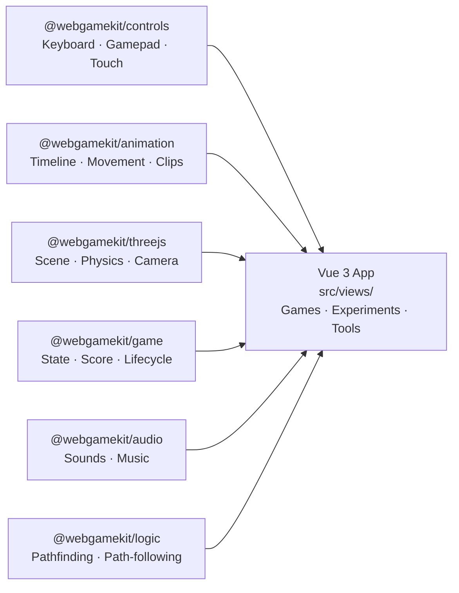

# WebGameKit

Framework-agnostic toolkit for creating 3D games, environments, and generative art with Three.js and Rapier physics.

[**Get Started →**](./docs/getting-started) &nbsp;&nbsp; [**Journey →**](./docs/journey/overview)

---

## Packages

### [@webgamekit/threejs](./docs/packages/threejs)

Core 3D engine. Wraps Three.js scene setup, Rapier physics, model loading, camera helpers, and post-processing into a single `getTools()` call. Provides the `useSceneViewStore` Pinia integration for Vue views.

```ts
import { getTools } from '@webgamekit/threejs';
const { scene, camera, world, animate } = await getTools({ canvas });
```

---

### [@webgamekit/animation](./docs/packages/animation)

Character animation and timeline system. Handles GLTF mixer actions (walk, idle, blocking clips), physics-based movement with ground detection, and a frame-accurate timeline manager for coordinating per-frame updates.

```ts
import { animateTimeline, controllerForward } from '@webgamekit/animation';
```

---

### [@webgamekit/controls](./docs/packages/controls)

Unified input controller for keyboard, gamepad, touch (faux-pad joystick), and mouse. Maps raw inputs to named actions; supports 8-way directional input and configurable axis thresholds.

```ts
import { controlsCreate } from '@webgamekit/controls';
const { currentActions } = controlsCreate({ mapping: { keyboard: { w: 'move-forward' } } });
```

---

### [@webgamekit/game](./docs/packages/game)

Lightweight reactive game state. Framework-agnostic shallow store with action-based updates, score tracking, and lifecycle status (`idle | playing | paused | over`).

```ts
import { createGame } from '@webgamekit/game';
const game = createGame({ score: 0, lives: 3 });
game.setData('score', 100);
```

---

### [@webgamekit/audio](./docs/packages/audio)

Minimal audio playback utilities for background music and sound effects using the Web Audio API.

```ts
import { initializeAudio, createSound, playSound } from '@webgamekit/audio';
const sfx = createSound(initializeAudio(), '/audio/jump.mp3');
playSound(sfx);
```

---

### [@webgamekit/logic](./docs/packages/threejs)

Pathfinding and path-following utilities. Provides A\* on a grid with obstacle support, smooth path interpolation, and node-height snapping for 3D terrains.

```ts
import { findPath, followPath } from '@webgamekit/logic';
```

---

## Architecture


