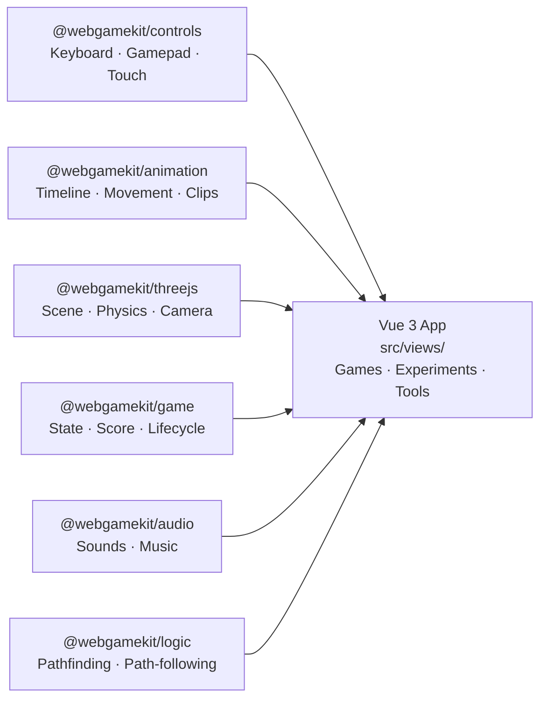

# WebGameKit

**3D games on the web, without the framework tax.** Three.js and Rapier physics wrapped into a
scene, a loop and an input layer you can install — no React, no Vue, no engine to learn. Works
anywhere, including the Vue and vanilla-JS projects the 3D ecosystem has largely skipped.

```bash
pnpm add @webgamekit/threejs three @dimforge/rapier3d-compat
```

[**Get Started →**](./docs/getting-started) &nbsp;&nbsp; [**Contributing →**](./docs/contributing) &nbsp;&nbsp; [**Journey →**](./docs/journey/animation)

## Start from a template

Standalone Vite apps of about a hundred lines each, built to be copied rather than read.

| Template                                                                                            | Shows                                                            |
| --------------------------------------------------------------------------------------------------- | ---------------------------------------------------------------- |
| [Platformer starter](https://github.com/cnotv/generative-art/tree/main/examples/platformer-starter) | third-person movement, jumping, fixed platforms, a follow camera |
| [Runner starter](https://github.com/cnotv/generative-art/tree/main/examples/runner-starter)         | lane switching, spawning and despawning, scoring, collision      |

---

## Packages

### [@webgamekit/threejs](./docs/packages/threejs)

Core 3D engine. Wraps Three.js scene setup, Rapier physics, model loading, camera helpers, and post-processing into a single `getTools()` call. Provides the `useSceneViewStore` Pinia integration for Vue views.

```ts
import { getTools } from '@webgamekit/threejs'
const { scene, camera, world, animate } = await getTools({ canvas })
```

---

### [@webgamekit/animation](./docs/packages/animation)

Character animation and timeline system. Handles GLTF mixer actions (walk, idle, blocking clips), physics-based movement with ground detection, and a frame-accurate timeline manager for coordinating per-frame updates.

```ts
import { animateTimeline, controllerForward } from '@webgamekit/animation'
```

---

### [@webgamekit/controls](./docs/packages/controls)

Unified input controller for keyboard, gamepad, touch (faux-pad joystick), and mouse. Maps raw inputs to named actions; supports 8-way directional input and configurable axis thresholds.

```ts
import { createControls } from '@webgamekit/controls'
const { currentActions } = createControls({ mapping: { keyboard: { w: 'move-forward' } } })
```

---

### [@webgamekit/game](./docs/packages/game)

Lightweight reactive game state. Framework-agnostic shallow store with action-based updates, score tracking, and lifecycle status (`idle | playing | paused | over`).

```ts
import { createGame } from '@webgamekit/game'
const game = createGame({ score: 0, lives: 3 })
game.setData('score', 100)
```

---

### [@webgamekit/audio](./docs/packages/audio)

Minimal audio playback utilities for background music and sound effects using the Web Audio API.

```ts
import { initializeAudio, createSound, playSound } from '@webgamekit/audio'
const sfx = createSound(initializeAudio(), '/audio/jump.mp3')
playSound(sfx)
```

---

### [@webgamekit/logic](./docs/packages/logic)

Pathfinding and path-following utilities. Provides A\* on a grid with obstacle support, smooth path interpolation, and node-height snapping for 3D terrains.

```ts
import { logicCreateGrid, logicGetBestRoute } from '@webgamekit/logic'
const path = logicGetBestRoute(navGrid, start, goal)
```

---

## Architecture


```mermaid
graph LR
  Controls["@webgamekit/controls\nKeyboard · Gamepad · Touch"] --> App
  Animation["@webgamekit/animation\nTimeline · Movement · Clips"] --> App
  Threejs["@webgamekit/threejs\nScene · Physics · Camera"] --> App
  Game["@webgamekit/game\nState · Score · Lifecycle"] --> App
  Audio["@webgamekit/audio\nSounds · Music"] --> App
  Logic["@webgamekit/logic\nPathfinding · Path-following"] --> App
  App["Vue 3 App\nsrc/views/\nGames · Experiments · Tools"]
```
